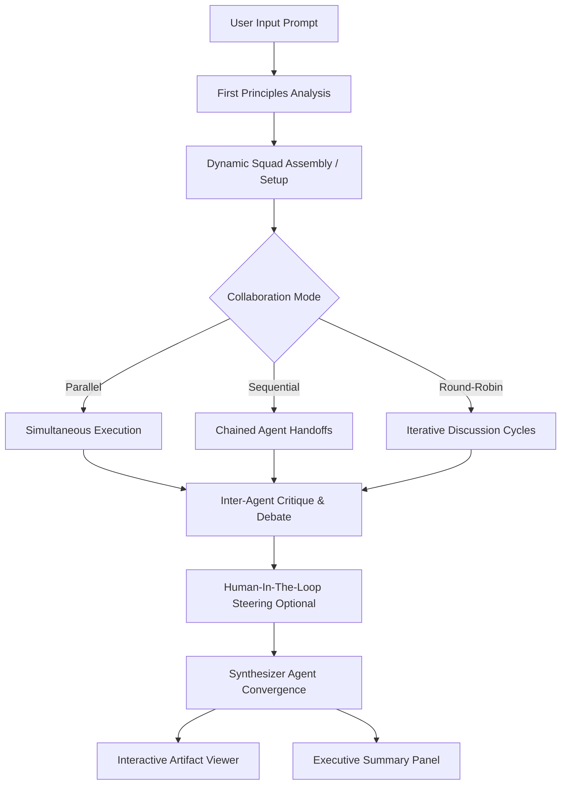

<h1 align="center">🌌 The Infinite Intelligence</h1>

<p align="center">
  <a href="https://opensource.org/licenses/MIT"></a>
  <a href="https://react.dev/"></a>
  <a href="https://vitejs.dev/"></a>
  <a href="https://www.typescriptlang.org/"></a>
  <a href="https://tailwindcss.com/"></a>
  <a href="https://vitest.dev/"></a>
  <a href="https://ai.google.dev/gemma"></a>
</p>

**The Infinite Intelligence** is a premium, client-side multi-agent AI orchestration platform designed to solve the problem of **reasoning saturation and bias** in single-agent prompts. By organizing a specialized squad of four distinct expert personas (and custom user-defined agents), the platform analyzes problems from **first principles**, facilitates inter-agent debate, and synthesizes unified executive reports.

Built as an interactive single-page application (SPA), the workspace prioritizes visual clarity, modularity, and high-performance client-side execution using Google's **Gemma 4 31B (`gemma-4-31b-it`)** via `@google/genai`.

---

## 📖 Table of Contents

- [🤔 The "Why" behind The Infinite Intelligence](#-the-why-behind-the-infinite-intelligence)
- [🏗️ Orchestration Flow & Architecture](#%EF%B8%8F-orchestration-flow--architecture)
- [✨ Key Features](#-key-features)
- [💻 Technology Stack & Architecture Decisions](#-technology-stack--architecture-decisions)
- [🚀 Quick Start & Installation](#-quick-start--installation)
- [🎮 Usage Instructions & Examples](#-usage-instructions--examples)
- [🛠️ Developer Guide (Extending the Squad)](#%EF%B8%8F-developer-guide-extending-the-squad)
- [🧪 Testing & Quality Assurance](#-testing--quality-assurance)
- [🤝 Contribution Guidelines](#-contribution-guidelines)
- [👤 Author](#-author)
- [📄 License](#-license)

---

## 🤔 The "Why" behind The Infinite Intelligence

Single-agent prompts often fall short when addressing high-stakes or multi-dimensional problems. They are prone to bias, early saturation of reasoning, and occasional hallucinations. 

**The Infinite Intelligence** addresses these challenges using a collaborative, multi-agent pattern:
*   **Diverse Perspectives:** By splitting a request among specialized personas (e.g., an analyst, a pragmatist, a coder, and a critic), the problem is thoroughly examined from multiple professional angles.
*   **Adversarial Refinement:** Before presenting a solution, the agents review and critique each other's work over configurable rounds to identify logical gaps, missing constraints, or flawed assumptions.
*   **First-Principles Grounding:** Rather than rushing to generate a response, the platform forces a preliminary analysis phase to extract the core truths, target boundaries, and critical dependencies.
*   **Zero Server Footprint:** By executing directly in the browser via highly optimized client-side React and direct API calls, users maintain complete control of their API key usage and session data without sending data to third-party database backends.

---

## 🏗️ Orchestration Flow & Architecture

The application follows a structured, modular pipeline where each step is visualised in real-time for maximum auditability:



### Flow Breakdown:
1.  **First Principles Phase:** Translates the user's prompt into an underlying foundation of fundamental truths.
2.  **Squad Allocation:** Deploys the active four-agent expert team (or dynamically generates customized agent personas in **Beta Mode**).
3.  **Coordination Mode:** Runs the agents using the selected topology (Parallel, Sequential, or Round-Robin).
4.  **Critique & Debates:** Evaluates intermediate outputs across configured cycles (up to 5 rounds) for cross-refinement.
5.  **Steering (HITL):** Allows you to approve, redirect, or critique individual agent insights before compiling the final response.
6.  **Synthesis:** Merges all agent outputs, critique logs, and user guidance into a clean, markdown-rendered master report.

---

## ✨ Key Features

| Feature | Description | Business/Developer Benefit |
| :--- | :--- | :--- |
| **Multi-Agent Topologies** | Run parallel, sequential, or round-robin debate flows with configurable refinement cycles. | Flexibility to adjust execution cost, latency, and reasoning depth per request. |
| **First-Principles Engine** | Automatically deconstructs prompts into core goals, constraints, and dependencies first. | Drastically improves agent accuracy and reduces off-topic generation. |
| **Beta Mode (Dynamic Squad)** | Dynamically generates custom-tailored agent personas optimized for the specific task. | Immediate expert alignment without needing manual prompt configuration. |
| **Human-In-The-Loop (HITL)** | Intercept, score (thumbs up/down), or rewrite agent directions mid-generation. | Ensures the final synthesized response aligns exactly with your intent. |
| **Interactive Artifact Panel** | Automatically extracts code snippets, JSON objects, and documents to a side panel. | Clear separation of code/data from explanations, perfect for copying or reviewing. |
| **Session Branching & History** | Fork any conversation branch at any historical node to explore new alternatives. | Safe, non-destructive experimentation during long sessions. |
| **Executive Reports** | Download reports instantly as styled PDFs or standard Markdown files. | Professional presentation format ready to share with teams or clients. |
| **Token & Cost Metrics** | Track exact input/output tokens and estimate API costs in real-time. | Total visibility over resource usage and prompt performance. |

---

## 💻 Technology Stack & Architecture Decisions

We carefully selected our stack to prioritize client-side performance, maintainability, and user privacy.

*   **Core UI & State:** [React 19](https://react.dev/) & [TypeScript](https://www.typescriptlang.org/)
    *   *Why:* Ensures predictable, type-safe state management across complex sidebars, modals, and streaming states. React 19's concurrent features handle heavy UI updates smoothly.
*   **Styling & Themes:** [Tailwind CSS](https://tailwindcss.com/)
    *   *Why:* Enables rapid, consistent styling. We use a dark-mode-first, frosted glass (glassmorphism) layout to reduce eye strain during long reasoning sessions.
*   **Animations:** [Motion 12](https://motion.dev/)
    *   *Why:* Provides fluid micro-interactions and slide-out sidebar panels, making the complex multi-agent UI feel responsive and intuitive.
*   **Icons:** [Lucide React](https://lucide.dev/)
    *   *Why:* Consistent, high-quality outline vector iconography.
*   **AI Service Layer:** `@google/genai` (using Gemma 4 31B `gemma-4-31b-it`)
    *   *Why:* Offers state-of-the-art reasoning capabilities with robust support for streaming and system instructions, directly from the client.
*   **Document Export:** `html2canvas` & `jsPDF`
    *   *Why:* Client-side HTML-to-vector PDF translation.
*   **Zero-Backend Architecture:** Client-side execution
    *   *Why:* Ensures zero server footprint. Users maintain complete control of their API keys and session data, maximizing privacy and reducing operational costs.
*   **Test Runner:** [Vitest](https://vitest.dev/) & [React Testing Library](https://testing-library.com/)
    *   *Why:* Light-speed test execution with complete DOM mocking and coverage indicators.

---

## 🚀 Quick Start & Installation

### Prerequisites
*   **Node.js** (v18.0.0 or higher)
*   **npm** or **yarn** package manager
*   A **Google Gemini API Key** (Get one from [Google AI Studio](https://aistudio.google.com/))

### Installation Steps

1.  **Clone the Repository**
    ```bash
    git clone https://github.com/dhaatrik/the-infinite-intelligence.git
    cd the-infinite-intelligence
    ```

2.  **Install Project Dependencies**
    ```bash
    npm install
    ```

3.  **Configure Environment Variables**
    Create a `.env` file in the root directory:
    ```env
    VITE_GEMINI_API_KEY=your_gemini_api_key_here
    ```

4.  **Launch the Development Server**
    ```bash
    npm run dev
    ```
    Open your browser and navigate to `http://localhost:5173`.

5.  **Compile the Production Bundle**
    ```bash
    npm run build
    ```
    Static build files will be outputted to the `dist/` directory, optimized and ready for production deployment (e.g., Vercel, Netlify, or GitHub Pages).

---

## 🎮 Usage Instructions & Examples

Once the application is running, follow these steps to leverage the multi-agent squad:

### 1. Formulate Your Prompt
Start by entering a complex query in the main input area. The platform excels at high-complexity reasoning tasks.
*Example: "Design a scalable system architecture for a real-time collaborative document editor, highlighting potential bottlenecks and security concerns."*

### 2. Choose Your Orchestration Mode
Select how the agents should collaborate:
- **Parallel:** Agents work simultaneously for faster, independent perspectives.
- **Sequential:** Agents build upon each other's work (e.g., Analyst -> Coder -> Critic).
- **Round-Robin:** Agents engage in iterative debate to refine the solution.

### 3. Review and Steer (Human-In-The-Loop)
As agents generate insights, use the steering controls to guide them:
- Click the **thumbs up/down** to approve or reject specific agent thoughts.
- Add steering comments to redirect an agent's focus before the next iteration.

### 4. Export the Executive Summary
Once the squad reaches a consensus, the Synthesizer agent will compile a master report.
- Click the **Export PDF** or **Export Markdown** buttons to save the final report.

---

## 🛠️ Developer Guide (Extending the Squad)

The Infinite Intelligence is architected to make adding new agent configurations, icons, and structures incredibly simple. 

### 1. Register a New Base Agent
Open `constants.ts` and append your agent config to the `DEFAULT_AGENTS` array. The model automatically respects all custom guidelines defined in `systemInstruction`:

```typescript
// constants.ts
export const DEFAULT_AGENTS: Agent[] = [
  // ... existing agents
  {
    id: 'security-auditor',
    name: 'Shield_Agent',
    role: 'Security & Vulnerability Auditor',
    systemInstruction: 'You are an elite cybersecurity specialist. Your goal is to review all proposed architectures, code, and systems to detect vulnerabilities, data leaks, and compliance gaps. Provide specific patches.',
    icon: 'ShieldCheck',
    color: 'text-rose-400 border-rose-500/20 bg-rose-500/5',
  }
];
```

### 2. Verify or Update TypeScript Definitions
Ensure any dynamic configurations or new parameters are represented in `types.ts`:

```typescript
// types.ts
export interface Agent {
  id: string;
  name: string;
  role: string;
  systemInstruction: string;
  icon: string;
  color: string;
}
```

---

## 🧪 Testing & Quality Assurance

To maintain excellent stability, all critical UI components (Sidebars, Cards, Settings modal, Markdown renderers, and state logic) are backed by automated tests using **Vitest** and **React Testing Library**.

### Execution Command
Run the complete test runner:
```bash
npm run test
```

### Testing Strategy
-   **Unit Tests:** Verifies individual helper utilities and constants (e.g., [constants.test.ts](file:///e:/E%20Drive%20Projects/00%20Github/the-infinite-intelligence/tests/constants.test.ts)).
-   **Component Mocking:** Exercises conditional rendering, trigger buttons, state propagation, and router integration for complex items like [SettingsModal.test.tsx](file:///e:/E%20Drive%20Projects/00%20Github/the-infinite-intelligence/tests/SettingsModal.test.tsx) and [AgentPresetsSidebar.test.tsx](file:///e:/E%20Drive%20Projects/00%20Github/the-infinite-intelligence/tests/AgentPresetsSidebar.test.tsx).
-   **Type Integrity Check:** Strictly validated by running `npm run lint` (`tsc --noEmit`) to ensure clean compilations.

---

## 🤝 Contribution Guidelines

Contributions make the open-source community an amazing place to learn, inspire, and create. If you'd like to participate:

1.  Review our structured [Contributing Guidelines](CONTRIBUTING.md).
2.  Fork the repository and create your feature branch: `git checkout -b feature/AmazingFeature`.
3.  Ensure your code satisfies the type-checker by running `npm run lint`.
4.  Add robust tests for your new component or utility.
5.  Open a detailed Pull Request detailing your implementation decisions.

---

## 👤 Author

**Dhaatrik Chowdhury**
*   **GitHub:** [@dhaatrik](https://github.com/dhaatrik)
*   **LinkedIn:** [dhaatrik](https://www.linkedin.com/in/dhaatrik/)
*   **X / Twitter:** [@dhaatrik](https://x.com/dhaatrik)

---

## 📄 License

This project is licensed under the terms of the **MIT License**. Check the [LICENSE](LICENSE) file for complete terms and permissions.

---

<p align="center">
  <b>Empowering human decisions with the precision of collective intelligence. 🌌</b>
</p>
